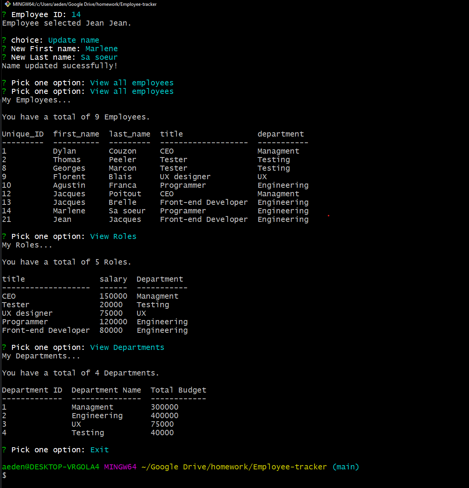

# README Generator
Homework for UC Berkeley Extension Coding Bootcamp



## Technologies Used
- Javascript - Backend coding
- Node - JavaScript runtime environment
- inquirer - Node library for Prompts
- Mysql - Database managment system

## Summary 

This command-line app allows you to manage a company’s employee database.

* Create roles and departments. 
* Add, edit, and remove employees
* Look for employees
* Generate a budget per Departments


## How to install
You would need to download the project on your local machine, install node.js then run the command :

```
node install
```

Then update your Mysql infos in lib/mysql.js, then execute the db.sql in Mysql.

## How to use it
run the commande 

```
node index.js
```

## Code Snippet 
```js
    viewDepartments(cb) {
        let final;
        let result;
        console.log('My Departments...\n');
        //Select all the data from each Dept
        connection.query(`SELECT * FROM department`,
            async (err, res) => {
                let dptData = [];
                if (err) throw err;
                console.log(`You have a total of ${res.length} Departments. \n`);
                if (res.length != 0) {
                    //Iterate through each dept
                     result = await Promise.all(res.map((data) => {
                        let budget = 0;
                        connection.query(`SELECT * 
                        FROM role
                        INNER JOIN employee ON role.id = employee.role_id
                        WHERE role.department_id = '${data.id}'`,
                            async (err, res2) => {
                                if (err) throw err;
                                final = await Promise.all(res2.map((data2) => {
                                     budget += data2.salary;
                                }))
                                dptData.push({
                                    "Department ID": data.id,
                                    "Department Name": data.name,
                                    "Total Budget": budget,
                                });
                                
                                return dptData;
                            })
                    }));
                    // console.log(result);
                    setTimeout(function () { 
                        console.table(dptData); 
                        cb();
                    }, 500);

                }
            })
    },
```

This function allow me to generate the Total budget per department, including every employee for each role.


## Author Links
[LinkedIn](https://www.linkedin.com/in/dcouzon/)
[GitHub](https://github.com/Dylancouzon)

